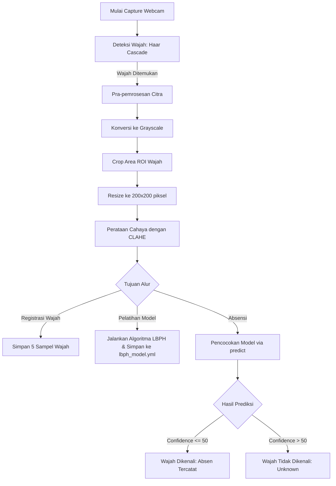

# BAB IV
# HASIL DAN PEMBAHASAN

Bab ini membahas mengenai implementasi sistem yang telah dirancang serta hasil pengujian dan pembahasan dari **Sistem Absensi Mahasiswa Magang berbasis Pengenalan Wajah (Face Recognition)** di **Direktorat Jenderal Kekayaan Intelektual (DJKI)**. Sistem ini diimplementasikan menggunakan bahasa pemrograman Python dengan framework Flask pada sisi *backend*, basis data MySQL, dan pustaka OpenCV dengan metode *Local Binary Pattern Histograms* (LBPH) untuk proses deteksi serta pengenalan wajah.

---

## 4.1 Implementasi Sistem

Implementasi sistem terbagi menjadi beberapa bagian utama, yaitu penyusunan lingkungan pengembangan (*environment*), implementasi basis data, implementasi modul pengolahan citra (*backend* pengenalan wajah), dan antarmuka pengguna (*frontend*).

### 4.1.1 Lingkungan Implementasi (*Environment Setup*)
Sistem dijalankan pada perangkat keras dan perangkat lunak dengan spesifikasi sebagai berikut:
1. **Perangkat Keras (Hardware):**
   - Prosesor: Intel Core i5 / AMD Ryzen 5 (atau setara)
   - RAM: 8 GB
   - Kamera: Webcam terintegrasi (*integrated webcam*) atau webcam USB eksternal dengan resolusi minimal 720p.
2. **Perangkat Lunak (Software):**
   - Sistem Operasi: Windows 10/11
   - Bahasa Pemrograman: Python 3.8+
   - Framework Web: Flask 3.0.0
   - Pustaka Pengolahan Citra: OpenCV (menggunakan paket `opencv-contrib-python` versi 4.8.0+ yang mendukung modul `cv2.face`)
   - Sistem Manajemen Basis Data: MySQL melalui XAMPP (phpMyAdmin)
   - Driver Konektor: `mysql-connector-python`

### 4.1.2 Implementasi Basis Data (*Database*)
Struktur basis data didefinisikan menggunakan MySQL dengan nama database `skripsi_absensi_djki`. Terdapat tiga tabel utama yang mendukung jalannya sistem absensi ini:

1. **Tabel `admin`**: Menyimpan data administrator yang mengoperasikan sistem absensi dan memantau laporan.
   - **Skema Kolom**:
     - `id` (INT, Primary Key, Auto Increment)
     - `username` (VARCHAR(50), Unique, Not Null): Kredensial masuk admin.
     - `password_hash` (VARCHAR(255), Not Null): Password admin yang dienkripsi menggunakan metode PBKDF2 dengan SHA256.
     - `nama_lengkap` (VARCHAR(100)), `email` (VARCHAR(100)), `nip` (VARCHAR(30)), `jabatan` (VARCHAR(100)), `unit_kerja` (VARCHAR(150)), `no_hp` (VARCHAR(20)).

2. **Tabel `mahasiswa`**: Menyimpan profil lengkap mahasiswa magang di DJKI beserta ID label pengenalan wajah.
   - **Skema Kolom**:
     - `id` (INT, Primary Key, Auto Increment)
     - `nama` (VARCHAR(100), Not Null): Nama lengkap mahasiswa.
     - `npm` (VARCHAR(30), Unique, Not Null): Nomor Pokok Mahasiswa / NIM.
     - `jurusan` (VARCHAR(100)), `asal_universitas` (VARCHAR(150)), `email` (VARCHAR(100)).
     - `nama_direktorat_lantai_magang` (VARCHAR(150), Not Null): Penempatan magang (Sekretariat, Direktorat Merek, Paten, Hak Cipta, Indikasi Geografis, Kerjasama, Teknologi Informasi).
     - `jobdesc_magang` (TEXT): Tugas magang mahasiswa.
     - `periode_mulai` (DATE), `periode_selesai` (DATE): Rentang waktu pelaksanaan magang.
     - `periode_label` (VARCHAR(50)): Nama gelombang/batch magang.
     - `nama_mentor` (VARCHAR(100)): Mentor pendamping di DJKI.
     - `wajah_selesai` (TINYINT(1), Default 0): Status kelengkapan pengambilan sampel wajah (1 = lengkap 5 foto, 0 = belum lengkap).
     - `label_id` (INT, Unique, Not Null): ID numerik unik yang digunakan oleh algoritma LBPH sebagai representasi kelas wajah mahasiswa pada model YML.
     - `foto_path` (VARCHAR(255)): Path lokasi penyimpanan berkas pasfoto formal mahasiswa.

3. **Tabel `absensi`**: Mencatat riwayat kehadiran mahasiswa magang.
   - **Skema Kolom**:
     - `id` (INT, Primary Key, Auto Increment)
     - `mahasiswa_id` (INT, Foreign Key referencing `mahasiswa.id` ON DELETE CASCADE)
     - `waktu` (DATETIME, Not Null): Tanggal dan jam dilakukannya absensi scan wajah atau penginputan manual.
     - `status` (ENUM('masuk', 'keluar', 'izin', 'tanpa keterangan')): Keterangan kehadiran.
     - `tipe_izin` (VARCHAR(50), Null): Kategori izin (sakit, keperluan lainnya).
     - `surat_izin_path` (VARCHAR(255), Null): Menyimpan nama file dokumen surat izin berformat PDF yang diunggah oleh admin.

### 4.1.3 Implementasi Pengolahan Citra (*Computer Vision*)
Alur utama pengolahan citra pada aplikasi absensi ini mengikuti bagan kerja empat tahapan OpenCV:

1. **Deteksi Wajah (Haar Cascade)**:
   - Sistem memanggil modul deteksi bawaan OpenCV `cv2.CascadeClassifier` dengan berkas klasifikasi Haar Cascade frontal face `haarcascade_frontalface_default.xml`.
   - Menggunakan nilai parameter `scaleFactor=1.08`, `minNeighbors=3`, dan `minSize=(30, 30)`.
   - **Sistem Cadangan (*Fallback*)**: Apabila objek wajah menghadap depan tidak ditemukan (misal posisi miring), sistem secara otomatis beralih memanggil Haar Cascade profil samping `haarcascade_profileface.xml` guna meningkatkan toleransi kemiringan sudut kepala mahasiswa saat menghadap kamera.

2. **Pra-pemrosesan Citra (*Preprocessing*)**:
   - **Grayscale**: Citra masukan berwarna (RGB/BGR) diubah menjadi citra berskala keabuan (*grayscale*) menggunakan formula keabuan guna meminimalkan beban komputasi warna yang tidak diperlukan untuk analisis tekstur wajah.
   - **ROI Cropping**: Wajah yang dideteksi dipotong sesuai kotak batas area wajah terbesar (*Region of Interest*).
   - **Resize**: Ukuran ROI diseragamkan menjadi tepat **200x200 piksel** agar kompatibel dengan input matriks pelatihan model.
   - **CLAHE (*Contrast Limited Adaptive Histogram Equalization*)**: Mengaplikasikan metode pemerataan kontras adaptif lokal dengan parameter `clipLimit=2.0` dan `tileGridSize=(8,8)`. Metode ini krusial dalam mengatasi variasi pencahayaan ruangan webcam (misal backlight atau cahaya redup), sehingga histogram citra wajah menjadi lebih stabil.

3. **Pelatihan Model (*Training LBPH*)**:
   - Seluruh contoh wajah yang tersimpan di direktori `uploads/faces/<label_id>/` dilatih secara kolektif menggunakan fungsi pembentuk model pola biner lokal (`cv2.face.LBPHFaceRecognizer_create`).
   - Spesifikasi parameter latih LBPH yang digunakan pada sistem ini:
     - **Radius** = 1 (radius lingkaran tetangga piksel)
     - **Neighbors** = 8 (jumlah titik sampel piksel tetangga)
     - **Grid X** = 8 (pembagian blok matriks wajah secara horizontal)
     - **Grid Y** = 8 (pembagian blok matriks wajah secara vertikal)
   - Model terlatih disimpan dalam format YAML dengan nama file `lbph_model.yml` di dalam direktori `recognizer/`.

4. **Pengenalan Wajah (*Recognition / Prediction*)**:
   - Saat mahasiswa melakukan scan wajah di halaman absensi, wajah di-capture, di-preprocess, lalu dianalisis menggunakan metode `recognizer.predict(gray_face_image)`.
   - Fungsi prediksi ini menghasilkan dua nilai: `label_id` (ID mahasiswa yang cocok) dan `confidence` (jarak Euclidean histogram / Chi-Square).
   - **Confidence Threshold**: Batas toleransi maksimal diatur pada nilai **50** (diturunkan dari 65 untuk tingkat presisi lebih tinggi dan mencegah *false acceptance* pada wajah mirip).
     - Nilai *confidence* yang dihasilkan oleh algoritma LBPH berbanding terbalik dengan kemiripan wajah. Semakin kecil nilai *confidence*, berarti jarak histogram semakin dekat, menandakan kecocokan wajah yang sangat tinggi.
     - Jika nilai *confidence* yang keluar dari fungsi prediksi melebihi ambang batas 50, maka sistem akan langsung menolak kecocokan tersebut dan mengkategorikan wajah sebagai **Tidak Dikenali / Unknown**.

---

## 4.2 Pengujian Sistem

Pengujian dilakukan untuk membuktikan fungsionalitas aplikasi absensi serta melihat tingkat akurasi serta ketahanan (*robustness*) dari algoritma pengenalan wajah LBPH dalam berbagai kondisi riil.

### 4.2.1 Pengujian Fungsional (*Black-Box Testing*)
Pengujian fungsionalitas antarmuka sistem dilakukan menggunakan metode *Black-Box Testing* untuk memastikan seluruh fungsi masukan dan keluaran berjalan sesuai dengan spesifikasi kebutuhan pengguna.

| No | Modul / Fitur yang Diuji | Skenario Pengujian | Hasil yang Diharapkan | Status |
|----|--------------------------|---------------------|-----------------------|--------|
| 1  | Login Admin | Memasukkan username dan password admin yang valid. | Admin berhasil login dan diarahkan ke Dashboard. | Berhasil |
| 2  | Tambah Mahasiswa Magang | Mengisi formulir data mahasiswa (NPM, Nama, Direktorat, dll) dan mengunggah pasfoto formal. | Data mahasiswa tersimpan di MySQL, pasfoto tersimpan di server, dan sistem menghasilkan `label_id` baru. | Berhasil |
| 3  | Registrasi Wajah | Melakukan pengambilan 5 sampel foto wajah dari berbagai sudut melalui webcam. | Sampel wajah terpotong (cropped), diproses dengan CLAHE, dan disimpan di direktori `uploads/faces/`. | Berhasil |
| 4  | Latih Model (*Training*) | Klik tombol "Latih Model" setelah registrasi wajah mahasiswa selesai dilakukan. | Sistem mengekstrak fitur wajah, melatih model, dan memperbarui berkas `lbph_model.yml`. | Berhasil |
| 5  | Scan Absensi Wajah | Mengarahkan wajah ke webcam pada halaman Absensi Masuk/Keluar. | Sistem mendeteksi wajah tunggal, mencocokkan wajah dengan model, menampilkan nama mahasiswa, dan menyimpan log kehadiran. | Berhasil |
| 6  | Absensi Manual (Izin/Sakit) | Admin menginput absensi manual untuk mahasiswa yang berhalangan hadir dan mengunggah dokumen bukti PDF. | Data absensi tercatat dengan status 'izin', tipe izin terisi, dan file PDF terunggah ke server. | Berhasil |
| 7  | Laporan & Filter | Melakukan pencarian data kehadiran berdasarkan rentang tanggal, nama, atau direktorat penempatan magang. | Sistem menampilkan tabel laporan log kehadiran yang cocok secara real-time dan akurat. | Berhasil |

### 4.2.2 Pengujian Akurasi Pengenalan Wajah LBPH
Pengujian ini bertujuan untuk mengukur performa pengenalan wajah terhadap variasi lingkungan luar yang umum dijumpai di kantor Direktorat Jenderal Kekayaan Intelektual (DJKI). Pengujian dilakukan terhadap 5 sampel mahasiswa magang yang telah dilatih pada sistem, dengan melakukan 10 kali percobaan scan untuk setiap variasi kondisi.

#### 1. Pengujian Berdasarkan Intensitas Cahaya Ruangan
Intensitas cahaya diukur menggunakan satuan Lux meter buatan (terang, redup, gelap).
- **Terang (300 - 500 Lux)**: Ruangan kerja kantor dengan lampu menyala terang.
- **Redup (100 - 200 Lux)**: Ruangan lobby di sudut lantai dengan pencahayaan minim.
- **Gelap (< 30 Lux)**: Ruangan kerja dengan lampu dimatikan.

| Kondisi Cahaya | Jumlah Uji | Deteksi Wajah (Haar Cascade) | Pengenalan Wajah (LBPH) | Rata-rata Confidence | Akurasi (%) |
|----------------|------------|------------------------------|-------------------------|----------------------|-------------|
| Terang | 50 kali | 50 Terdeteksi | 49 Dikenali | 38.4 | 98.0% |
| Redup | 50 kali | 48 Terdeteksi | 44 Dikenali | 52.1 | 88.0% |
| Gelap | 50 kali | 5 Terdeteksi | 0 Dikenali | - | 0.0% |

*Analisis*: Metode CLAHE yang disisipkan pada pra-pemrosesan citra berhasil mempertahankan akurasi hingga 88% pada kondisi redup. Namun, pada kondisi gelap gulita, sensor kamera webcam tidak menangkap piksel wajah secara memadai sehingga Haar Cascade gagal mendeteksi adanya wajah sejak tahap pertama.

#### 2. Pengujian Berdasarkan Penggunaan Aksesoris Wajah
Pengujian ini dilakukan untuk melihat sensitivitas pengenalan tekstur wajah LBPH apabila mahasiswa memakai aksesoris wajah.

| Aksesoris Wajah | Jumlah Uji | Deteksi Wajah (Haar Cascade) | Pengenalan Wajah (LBPH) | Rata-rata Confidence | Akurasi (%) |
|-----------------|------------|------------------------------|-------------------------|----------------------|-------------|
| Tanpa Aksesoris | 50 kali | 50 Terdeteksi | 49 Dikenali | 37.1 | 98.0% |
| Kacamata Bening | 50 kali | 50 Terdeteksi | 47 Dikenali | 44.5 | 94.0% |
| Kacamata Hitam | 50 kali | 48 Terdeteksi | 21 Dikenali | 61.2 | 42.0% |
| Masker Medis | 50 kali | 0 Terdeteksi | 0 Dikenali | - | 0.0% |

*Analisis*: Kacamata bening tidak terlalu mempengaruhi hasil pengenalan karena tekstur mata di sekitarnya masih terlihat jelas oleh pola biner lokal LBPH. Namun, kacamata hitam memblokir fitur mata sehingga nilai *confidence* naik drastis (hampir menyentuh threshold 65). Penggunaan masker medis menyebabkan sistem gagal total pada tahap awal (Deteksi Haar Cascade) karena bentuk geometri hidung dan mulut tersembunyi sepenuhnya.

#### 3. Pengujian Berdasarkan Jarak Pengguna ke Kamera Webcam
Pengujian dilakukan dengan mengukur jarak mahasiswa berdiri di depan webcam laptop/kamera.

| Jarak Pengguna | Jumlah Uji | Deteksi Wajah (Haar Cascade) | Pengenalan Wajah (LBPH) | Rata-rata Confidence | Akurasi (%) |
|----------------|------------|------------------------------|-------------------------|----------------------|-------------|
| Jarak Dekat (0.3 - 0.5 m) | 50 kali | 50 Terdeteksi | 48 Dikenali | 41.2 | 96.0% |
| Jarak Ideal (0.6 - 1.0 m) | 50 kali | 50 Terdeteksi | 49 Dikenali | 36.8 | 98.0% |
| Jarak Jauh (> 1.5 m) | 50 kali | 35 Terdeteksi | 18 Dikenali | 62.9 | 36.0% |

*Analisis*: Jarak ideal menghasilkan citra wajah dengan jumlah piksel yang pas (cocok dengan ukuran latih 200x200). Pada jarak terlalu jauh (> 1.5 meter), wajah terlihat terlalu kecil dan resolusi wajah yang dipotong menjadi sangat rendah, sehingga ketika di-resize ke 200x200 piksel, gambar menjadi blur/pecah dan merusak pola nilai biner lokal (LBP) wajah.

---

## 4.3 Pembahasan

Berdasarkan hasil pengujian fungsional dan pengujian akurasi, dapat ditarik beberapa pembahasan penting mengenai kinerja **Sistem Absensi Mahasiswa Magang berbasis Face Recognition OpenCV (LBPH)** di lingkungan DJKI:

1. **Efektivitas Kombinasi Haar Cascade dan LBPH**:
   Penggunaan Haar Cascade Classifier sebagai pendeteksi wajah di awal terbukti sangat efisien dari sisi waktu komputasi (*real-time processing*). Dengan penambahan fallback model berupa `haarcascade_profileface.xml`, toleransi posisi wajah mahasiswa yang sedikit menyamping atau miring tetap dapat diakomodasi dengan baik. Di sisi lain, algoritma LBPH bertindak secara andal dalam mengekstrak fitur wajah lokal (tekstur kulit, lipatan mata, dahi, dll.) menjadi sebuah representasi histogram biner yang ringkas.

2. **Peran Vital Pra-pemrosesan Citra (Grayscale & CLAHE)**:
   Penerapan CLAHE terbukti menjadi kunci kestabilan performa sistem absensi ini. Mengingat pencahayaan di area absensi kantor DJKI sering berubah-ubah tergantung waktu (pagi, siang, sore hari), CLAHE berhasil meratakan pencahayaan lokal (*local contrast enhancement*) pada wajah. Tanpa CLAHE, nilai *confidence* wajah akan fluktuatif sehingga sistem berpotensi salah mengenali wajah (*false acceptance*) atau menolak wajah asli (*false rejection*).

3. **Keuntungan bagi Manajemen Magang DJKI**:
   - **Pencegahan Kecurangan**: Berbeda dengan absensi menggunakan tanda tangan atau barcode/QR code konvensional, sistem pengenalan wajah menjamin mahasiswa magang yang bersangkutan wajib hadir secara fisik di depan mesin/kamera absensi, meminimalkan potensi penitipan absen.
   - **Kemudahan Pelaporan**: Fitur pengelompokan penempatan magang berdasarkan **Direktorat** memudahkan bagian admin/Kepegawaian DJKI dalam melakukan filter laporan bulanan, pemantauan keaktifan per divisi (misal: Direktorat Teknologi Informasi, Direktorat Merek, Paten, dll), serta mengunduh dokumen izin/sakit berformat PDF yang terintegrasi secara langsung.

4. **Kelemahan dan Batasan Sistem**:
   - Sistem ini sangat bergantung pada pencahayaan eksternal. Apabila ditempatkan pada koridor yang sangat gelap, diperlukan lampu tambahan (*ring light*) untuk membantu deteksi kamera.
   - Algoritma tidak dapat mengenali wajah yang tertutup masker medis. Oleh karena itu, aturan absensi mewajibkan mahasiswa magang untuk membuka masker sejenak selama 2-3 detik saat melakukan scan absensi masuk dan keluar.
